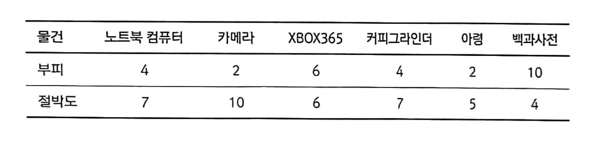

# 여행 짐 싸기 문제(대표적 DP문제: knapsack)

## 문제 설명


제한된 부피를 가진 가방에 절박도를 최대화하여 물건들을 담아야 하며, 담은 물건의 이름들을 출력하고, 총 부피와, 절박도를 출력한다.


## 예제
```text
6 10
laptop 4 7
camera 2 10
xbox 6 6
grinder 4 7
dumbell 2 5
encyclopedia 10 4
```

위 예제에서는 laptop, camera, grinder를 가방에 담는 것이 부피를 초과하지 않고 절박도를 최대화 하는 선택이며
그 때의 절박도 합은 24이며 물건의 개수는 3개이다.

## 문제 풀이 방법 1
각 물건이 포함되냐 안되냐 2가지 경우가 있으며 물건의 개수가 n개라면 $2^{n}$개의 경우가 있다.

n의 제한이 100개 이므로 상한은 $2^{100}$이고 이는 2억이상이므로 시간내에 해결할 수 없다.

## 문제 풀이 방법 2
특정 물건부터 마지막 물건까지 특정 부피가 남았을 때 고를 수 있는 물건들의 절박도의 합이 얼마인지를 구하면 최종적으로 모든 물건에 대해서 고를 수 있는 물건들의 절박도의 합의 최대를 구할 수 있다.

### $pack$함수
$pack(capacity, item)$ 는 남은 용량이 $capacity$인 경우 $item$ 이후 물건들을 싸서 얻을 수 있는 최대 절박도이다.

#### item을 싸지 않는 경우
$pack(capacity, item + 1)$값은 `$item$`을 고르지 않은 경우 `$item + 1$`부터 고를 수 있는 최대 절박도를 반환한다.

#### item을 싸는 경우
$pack(capacity - volume[item])$값은 `$item$`을 고른 경우 `$item + 1$`부터 고를 수 있는 최대 절박도를 반환한다.

#### 최종 디자인
$pack(capacity, item) = maximum(pack(capacity, item), pack(capacity - volume[item], item - 1))$


#### code
```cpp
int pack(int cap, int i) {
   if(i >= n) return 0;

   int& ret = cache[cap][i];
   if(ret != -1) return ret;

   if(vol[i] > cap)
      return ret = pack(cap, i + 1);

   return ret = max(pack(cap, i + 1), pack(cap - vol[i], i + 1) + need[i]);
}
```
#### `i`번째 물건을 담지 못하는 경우
i번째 물건을 담지 못하는 경우 `$cap$`보다 i번째 물건의 부피가 큰 경우이며 이때는 `cap`이 변하지 않고 `$i + 1$`을 조사하기 위해 재귀호출한다.

#### `i`번째 물건을 담을 수 있는 경우
1. `i`번째 물건을 담는 경우 `$cap - vol[i]$`한 값이 남은 부피 값이며 절박도는 `$need[i]$`만큼 상승한다.

2. `i`번째 물건을 담지 않는 경우 앞에서 언급한 식과 동일하며 이 두가지에 대해 최대 절박도를 반환한다.

